# service summary

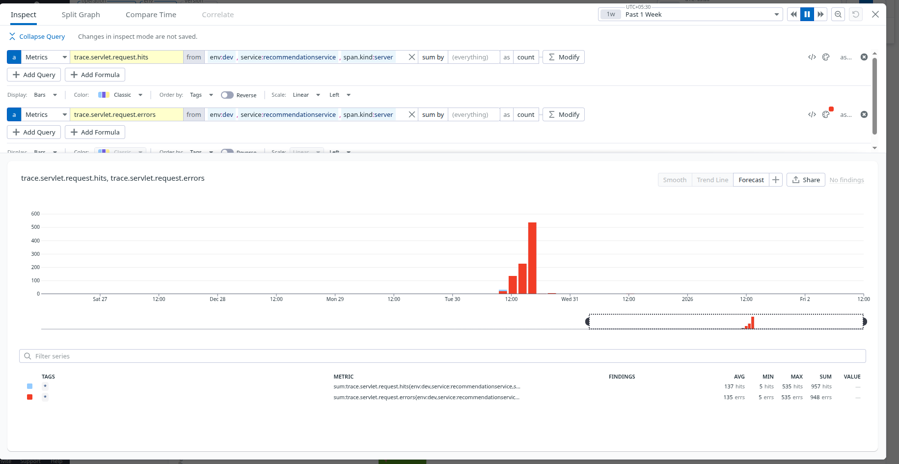

 ```{
  expr: [
    `sum(
      trace:servlet:request:hits{
        env:dev,
        service:recommendationservice,
        span.kind:server
      }
    )`
  ],
  name: "Servlet Request Hits",
  unit: "hits",
  type: "bar",
  description: "Total number of servlet requests handled by the recommendationservice server spans in the dev environment. This metric represents incoming request volume aggregated over time."
}
```

```
{
  expr: [
    `sum(
      trace:servlet:request:errors{
        env:dev,
        service:recommendationservice,
        span.kind:server
      }
    )`
  ],
  name: "Servlet Request Errors",
  unit: "errors",
  type: "bar",
  description: "Total number of servlet requests that resulted in errors for the recommendationservice server spans in the dev environment. This metric helps identify failed or unhealthy requests."
}
```

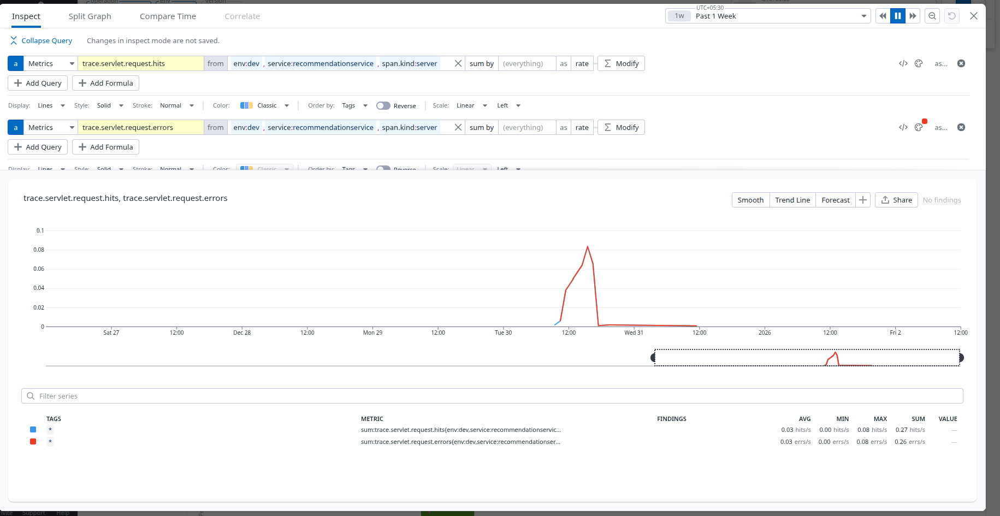

```
{
  expr: [
    `sum(
      trace:servlet:request:hits{
        env:dev,
        service:recommendationservice,
        span.kind:server
      }
    ).as_rate()`
  ],
  name: "Servlet Request Hit Rate",
  unit: "hits/s",
  type: "Lineplot",
  description: "Rate of incoming servlet requests per second for the recommendationservice server spans in the dev environment. This metric shows real-time traffic intensity rather than total request volume."
}
```

```
{
  expr: [
    `sum(
      trace:servlet:request:errors{
        env:dev,
        service:recommendationservice,
        span.kind:server
      }
    ).as_rate()`
  ],
  name: "Servlet Request Error Rate",
  unit: "errors/s",
  type: "Lineplot",
  description: "Rate of failed servlet requests per second for the recommendationservice server spans in the dev environment. This metric helps identify periods of elevated failure frequency."
}
```

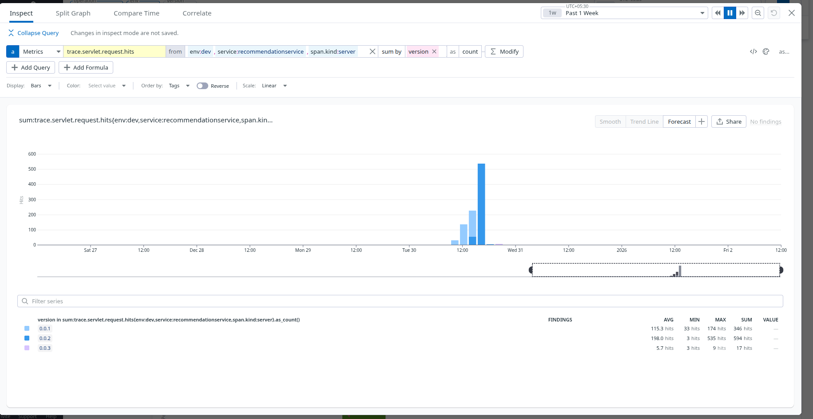

```
{
  expr: [
    `sum(
      trace:servlet:request:hits{
        env:dev,
        service:recommendationservice,
        span.kind:server
      } by {version}
    )`
  ],
  name: "Servlet Request Hits by Version",
  unit: "hits",
  type: "bar",
  description: "Bar chart showing the total number of servlet requests handled by each deployed version of the recommendationservice in the dev environment. This visualization helps compare traffic distribution across service versions during deployments or rollouts."
}
```

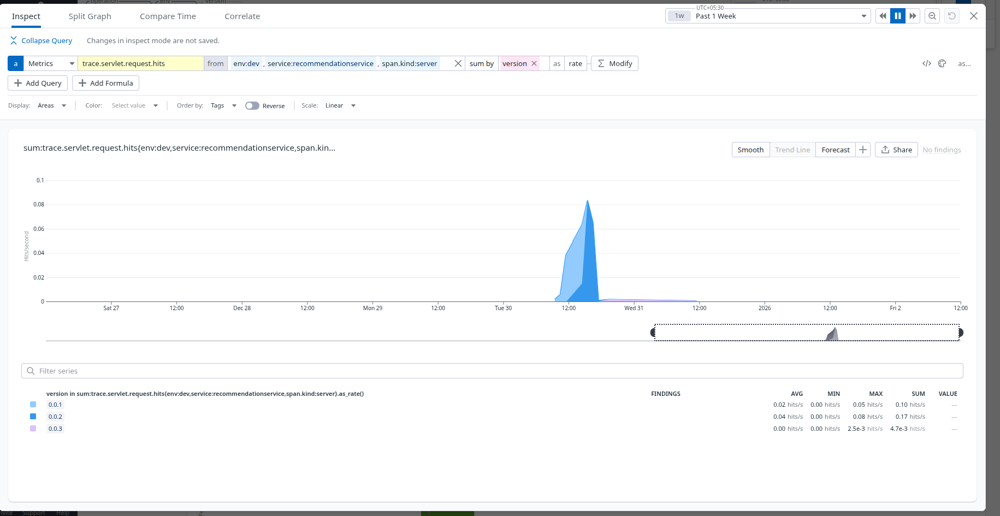

```
{
  expr: [
    `sum(
      trace:servlet:request:hits{
        env:dev,
        service:recommendationservice,
        span.kind:server
      } by {version}
    ).as_rate()`
  ],
  name: "Servlet Request Hit Rate by Version",
  unit: "hits/s",
  type: "Area",
  description: "Area chart showing the per-second rate of servlet requests handled by each deployed version of the recommendationservice in the dev environment. This visualization helps analyze traffic distribution and rollout behavior across service versions over time."
}
```

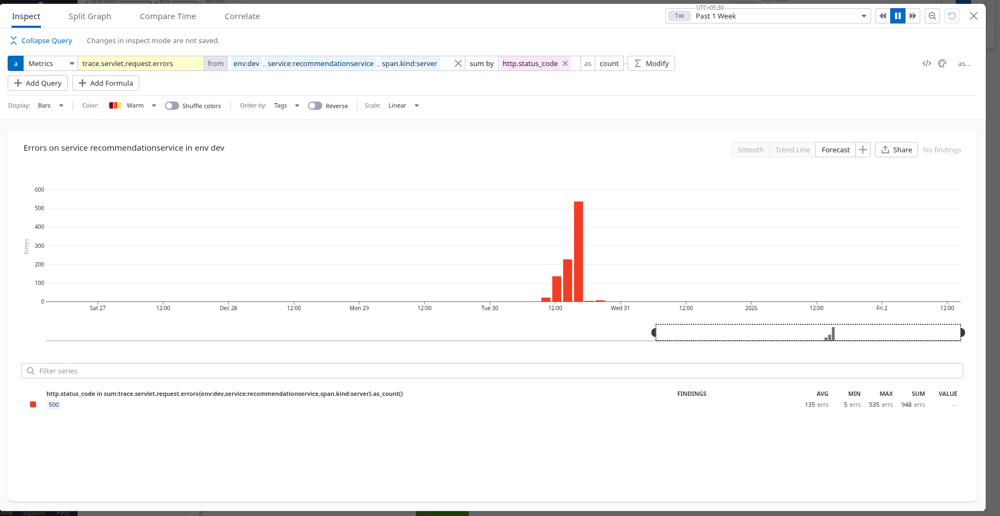

```
{
  expr: [
    `sum(
      trace:servlet:request:errors{
        env:dev,
        service:recommendationservice,
        span.kind:server
      } by {http.status_code}
    )`
  ],
  name: "Servlet Request Errors by HTTP Status Code",
  unit: "errors",
  type: "bar",
  description: "Bar chart showing the total number of servlet request errors grouped by HTTP status code for the recommendationservice in the dev environment. This visualization helps identify the dominant error classes, such as 5xx server-side failures."
}
```


```
{
  expr: [
    `sum(
      trace:servlet:request:errors{
        env:dev,
        service:recommendationservice,
        span.kind:server
      } by {http.status_code}
    ).as_rate()`
  ],
  name: "Servlet Request Error Rate by HTTP Status Code",
  unit: "errors/s",
  type: "Area",
  description: "Area chart showing the per-second rate of servlet request errors grouped by HTTP status code for the recommendationservice in the dev environment. This visualization highlights the frequency and trend of server-side failures over time."
}
```

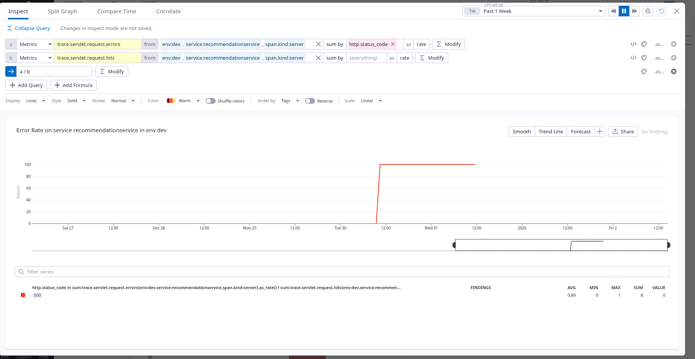

```
{
  expr: [
    `(
      sum(
        trace:servlet:request:errors{
          env:dev,
          service:recommendationservice,
          span.kind:server
        } by {http.status_code}
      ).as_rate()
      /
      sum(
        trace:servlet:request:hits{
          env:dev,
          service:recommendationservice,
          span.kind:server
        }
      ).as_rate()
    )`
  ],
  name: "Servlet Request Error Rate",
  unit: "percent",
  type: "Lineplot",
  description: "Line plot showing the error rate (percentage of failed requests) for the recommendationservice in the dev environment. The error rate is calculated as the ratio of servlet request errors per second to total servlet request hits per second, highlighting periods of complete or partial service failure."
}
```

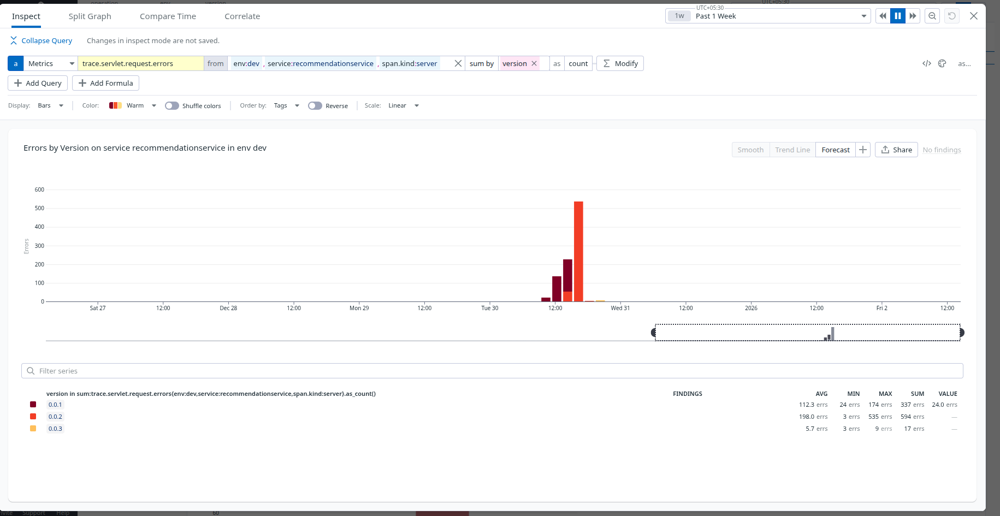

```
{
  expr: [
    `sum(
      trace:servlet:request:errors{
        env:dev,
        service:recommendationservice,
        span.kind:server
      } by {version}
    )`
  ],
  name: "Servlet Request Errors by Version",
  unit: "errors",
  type: "bar",
  description: "Bar chart showing the total number of servlet request errors grouped by service version for the recommendationservice in the dev environment. This visualization helps identify faulty deployments by comparing error volume across different service versions."
}
```


```
{
  expr: [
    `sum(
      trace:servlet:request:errors{
        env:dev,
        service:recommendationservice,
        span.kind:server
      } by {version}
    ).as_rate()`
  ],
  name: "Servlet Request Error Rate by Version",
  unit: "errors/s",
  type: "Area",
  description: "Area chart showing the per-second rate of servlet request errors grouped by service version for the recommendationservice in the dev environment. This visualization helps identify which deployment versions are actively generating failures over time."
}
```

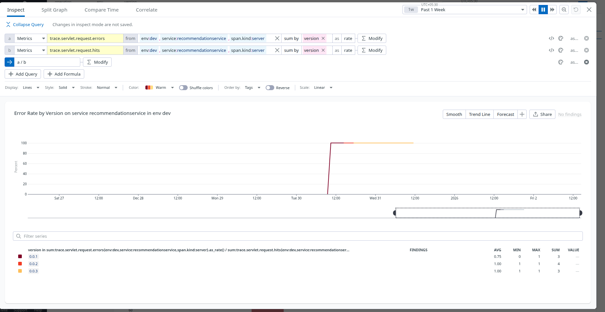

```
{
  expr: [
    `(
      sum(
        trace:servlet:request:errors{
          env:dev,
          service:recommendationservice,
          span.kind:server
        } by {version}
      ).as_rate()
      /
      sum(
        trace:servlet:request:hits{
          env:dev,
          service:recommendationservice,
          span.kind:server
        } by {version}
      ).as_rate()
    )`
  ],
  name: "Servlet Request Error Rate by Version",
  unit: "percent",
  type: "Lineplot",
  description: "Line plot showing the error rate percentage per service version for the recommendationservice in the dev environment. The metric is calculated as the ratio of servlet request errors per second to total servlet request hits per second, clearly highlighting faulty deployments where nearly all traffic fails."
}
```


```
{
  expr: [
    `p50(
      trace:servlet:request{
        env:dev,
        service:recommendationservice,
        span.kind:server
      } by {version}
    )`
  ],
  name: "Servlet Request Latency (p50) by Version",
  unit: "ms",
  type: "Lineplot",
  description: "Line plot showing the p50 (median) servlet request latency grouped by service version for the recommendationservice in the dev environment. This visualization helps compare typical response time behavior across different deployments."
}
```

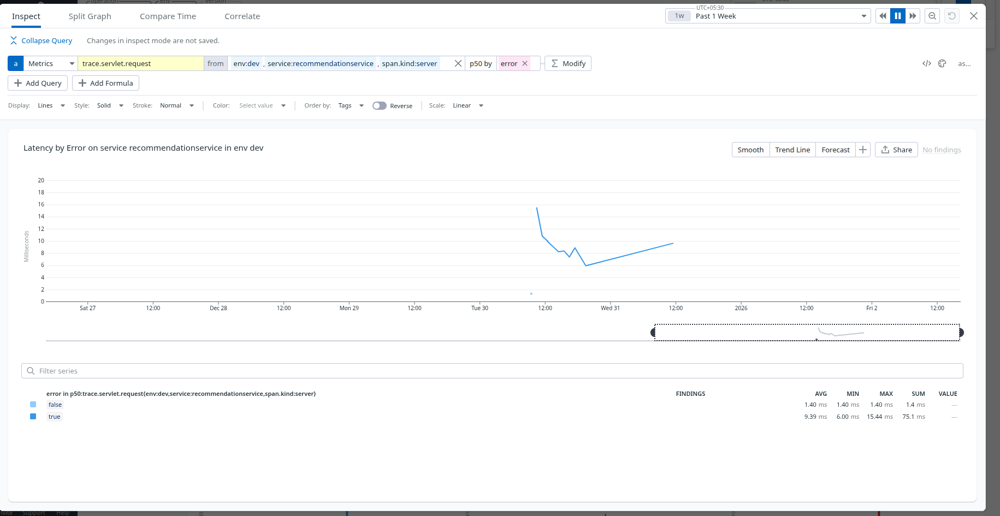

```
{
  expr: [
    `p50(
      trace:servlet:request{
        env:dev,
        service:recommendationservice,
        span.kind:server
      } by {error}
    )`
  ],
  name: "Servlet Request Latency (p50) by Error",
  unit: "ms",
  type: "Lineplot",
  description: "Median (p50) servlet request latency grouped by error flag for the recommendationservice in the dev environment. Compares latency behavior of successful (error=false) and failed (error=true) requests."
}
```

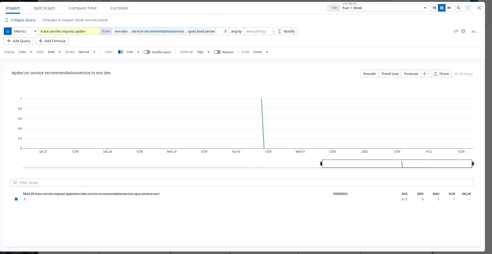

```
{
  expr: [
    `avg(
      trace:servlet:request.apdex{
        env:dev,
        service:recommendationservice,
        span.kind:server
      }
    )`
  ],
  name: "Servlet Request Apdex",
  unit: "",
  type: "Lineplot",
  description: "Apdex score for servlet requests on the recommendationservice in the dev environment. Apdex represents overall user satisfaction based on request latency and errors, with values ranging from 0 (poor) to 1 (excellent)."
}
```


```
{
  expr: [
    `p75(
      trace:servlet:request{
        env:dev,
        service:recommendationservice,
        span.kind:server
      } by {version}
    )`
  ],
  name: "Servlet Request Latency (p75) by Version",
  unit: "ms",
  type: "Lineplot",
  description: "p75 servlet request latency grouped by service version for the recommendationservice in the dev environment. This graph compares how the upper-quartile latency (75% of requests complete faster than this value) behaves across different deployments."
}
```


```
{
  expr: [
    `p75(
      trace:servlet:request{
        env:dev,
        service:recommendationservice,
        span.kind:server
      } by {error}
    )`
  ],
  name: "Servlet Request Latency (p75) by Error",
  unit: "ms",
  type: "Lineplot",
  description: "p75 servlet request latency grouped by error flag for the recommendationservice in the dev environment. Compares upper-quartile latency between successful (error=false) and failed (error=true) requests to understand failure behavior."
}
```


```
{
  expr: [
    `avg(
      trace:servlet:request.apdex{
        env:dev,
        service:recommendationservice,
        span.kind:server
      }
    )`
  ],
  name: "Apdex Score",
  unit: "",
  type: "Lineplot",
  description: "Average Apdex score for servlet requests on the recommendationservice in the dev environment. Apdex ranges from 0 to 1 and reflects overall user satisfaction based on request latency and error behavior."
}
```


```
{
  expr: [
    `p90(
      trace:servlet:request{
        env:dev,
        service:recommendationservice,
        span.kind:server
      } by {version}
    )`
  ],
  name: "Servlet Request Latency (p90) by Version",
  unit: "ms",
  type: "Lineplot",
  description: "p90 servlet request latency grouped by service version for the recommendationservice in the dev environment. Highlights tail latency behavior and helps identify performance regressions across deployments."
}
```


```
{
  expr: [
    `p90(
      trace:servlet:request{
        env:dev,
        service:recommendationservice,
        span.kind:server
      } by {error}
    )`
  ],
  name: "Servlet Request Latency (p90) by Error",
  unit: "ms",
  type: "Lineplot",
  description: "p90 servlet request latency split by error status for the recommendationservice in the dev environment. Highlights whether tail latency is driven by failed or successful requests."
}
```

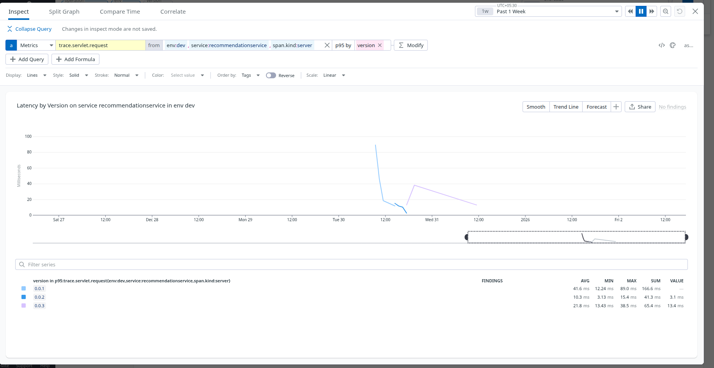

```
{
  expr: [
    `p95(
      trace:servlet:request{
        env:dev,
        service:recommendationservice,
        span.kind:server
      } by {version}
    )`
  ],
  name: "Servlet Request Latency (p95) by Version",
  unit: "ms",
  type: "Lineplot",
  description: "p95 servlet request latency grouped by service version for the recommendationservice in the dev environment. Highlights extreme tail latency and helps identify performance regressions affecting the slowest requests across deployments."
}
```


```
{
  expr: [
    `p95(
      trace:servlet:request{
        env:dev,
        service:recommendationservice,
        span.kind:server
      } by {error}
    )`
  ],
  name: "Servlet Request Latency (p95) by Error",
  unit: "ms",
  type: "Lineplot",
  description: "p95 servlet request latency split by error status (true vs false) for the recommendationservice in the dev environment. Helps determine whether extreme tail latency is driven by failed requests or slow successful execution paths."
}
```

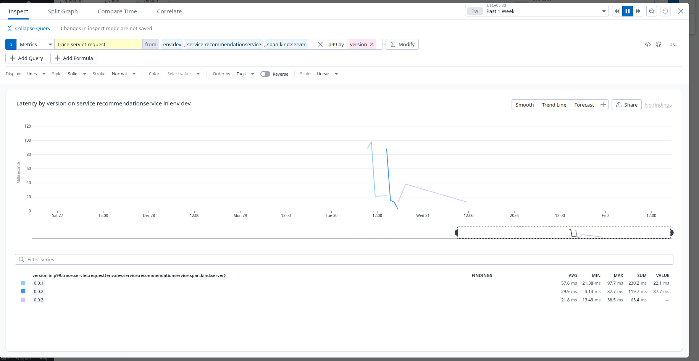

```
{
  expr: [
    `p99(
      trace:servlet:request{
        env:dev,
        service:recommendationservice,
        span.kind:server
      } by {version}
    )`
  ],
  name: "Servlet Request Latency (p99) by Version",
  unit: "ms",
  type: "Lineplot",
  description: "p99 servlet request latency grouped by service version for the recommendationservice in the dev environment. Highlights extreme tail latency affecting the slowest 1% of requests and helps identify severe performance regressions or improvements across deployments."
}
```

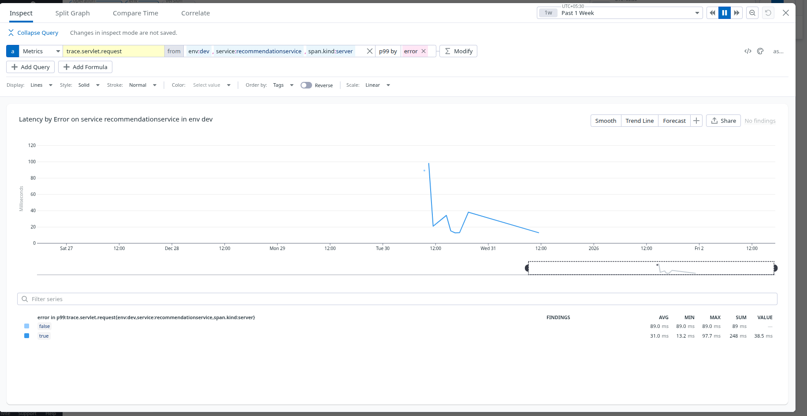

```
{
  expr: [
    `p99(
      trace:servlet:request{
        env:dev,
        service:recommendationservice,
        span.kind:server
      } by {error}
    )`
  ],
  name: "Servlet Request Latency (p99) by Error",
  unit: "ms",
  type: "Lineplot",
  description: "Line plot showing the p99 (99th percentile) servlet request latency split by error status (true vs false) for the recommendationservice in the dev environment. This helps determine whether tail latency is primarily caused by failed requests or by slow successful requests."
}
```


```
{
  expr: [
    `p99.9(
      trace:servlet:request{
        env:dev,
        service:recommendationservice,
        span.kind:server
      } by {version}
    )`
  ],
  name: "Servlet Request Latency (p99.9) by Version",
  unit: "ms",
  type: "Lineplot",
  description: "Line plot showing the p99.9 (99.9th percentile) servlet request latency grouped by service version for the recommendationservice in the dev environment. This graph highlights extreme tail latency and helps identify whether specific deployments introduce severe outliers affecting a very small percentage of requests."
}
```


```
{
  expr: [
    `p99.9(
      trace:servlet:request{
        env:dev,
        service:recommendationservice,
        span.kind:server
      } by {error}
    )`
  ],
  name: "Servlet Request Latency (p99.9) by Error",
  unit: "ms",
  type: "Lineplot",
  description: "Line plot showing the p99.9 (99.9th percentile) servlet request latency split by error status (true vs false) for the recommendationservice in the dev environment. This visualization highlights extreme tail latency and helps identify whether the worst latency spikes are associated with failed requests or successful ones."
}
```


```
{
  expr: [
    `max(
      trace:servlet:request{
        env:dev,
        service:recommendationservice,
        span.kind:server
      } by {version}
    )`
  ],
  name: "Servlet Request Max Latency by Version",
  unit: "s",
  type: "Lineplot",
  description: "Line plot showing the maximum observed servlet request latency grouped by service version for the recommendationservice in the dev environment. This graph highlights worst-case latency spikes per deployment version and helps identify versions that introduce severe performance regressions or outliers."
}
```

# endpoints

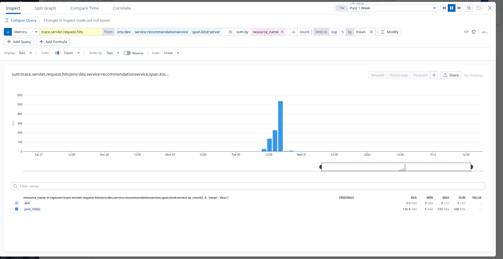

```
{
  expr: [
    `top(
      sum:trace:servlet:request:hits{
        env:dev,
        service:recommendationservice,
        span.kind:server
      } by {resource_name},
      5,
      'mean',
      'desc'
    )`
  ],
  name: "Top Servlet Endpoints by Request Volume",
  unit: "hits",
  type: "Bar",
  description: "Bar chart showing the top 5 servlet request endpoints by total request count, grouped by resource_name, for the recommendationservice in the dev environment. This visualization highlights the most frequently accessed endpoints and helps identify traffic hotspots and dominant API routes."
}
```


```
{
  expr: [
    `top(
      sum:trace:servlet:request:hits{
        env:dev,
        service:recommendationservice,
        span.kind:server
      } by {resource_name},
      10,
      'mean',
      'desc'
    )`
  ],
  name: "Top 10 Servlet Endpoints by Request Volume",
  unit: "hits",
  type: "Bar",
  description: "Bar chart displaying the top 10 servlet endpoints ranked by average request volume, grouped by resource_name, for the recommendationservice in the dev environment. This graph helps identify the most frequently accessed APIs and understand traffic distribution across endpoints."
}
```

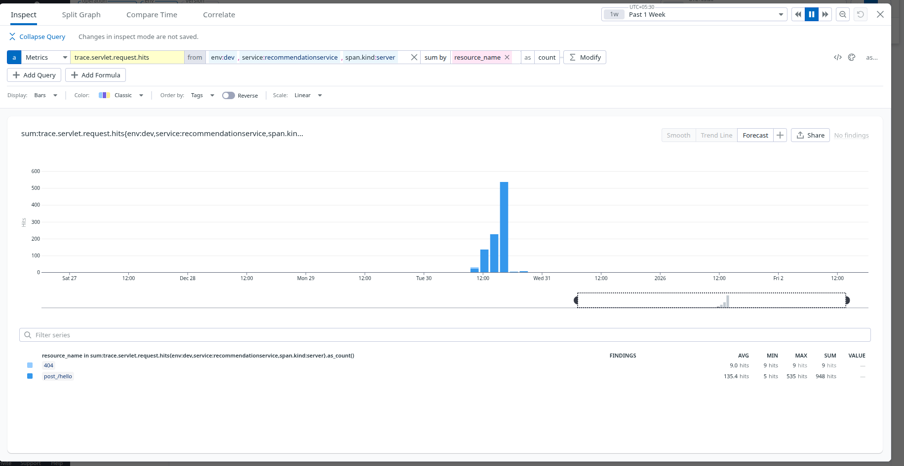

```
{
  expr: [
    `sum(
      trace:servlet:request:hits{
        env:dev,
        service:recommendationservice,
        span.kind:server
      }
    ) by {resource_name}`
  ],
  name: "Servlet Request Hits by Endpoint",
  unit: "hits",
  type: "Bar",
  description: "Bar chart showing the total number of servlet requests grouped by resource_name for the recommendationservice in the dev environment. This visualization provides a complete view of traffic distribution across all endpoints without limiting to top-N results."
}
```

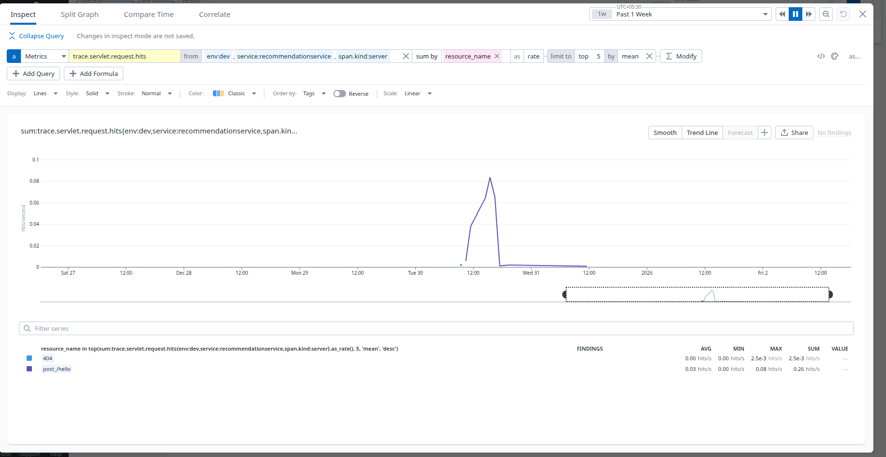

```
{
  expr: [
    `top(
      sum(
        trace:servlet:request:hits{
          env:dev,
          service:recommendationservice,
          span.kind:server
        }
      ) by {resource_name}.as_rate(),
      5,
      'mean',
      'desc'
    )`
  ],
  name: "Top 5 Endpoint Request Rate (hits/sec)",
  unit: "hits/s",
  type: "Lineplot",
  description: "Line plot showing the request rate (hits per second) for the top 5 servlet endpoints, grouped by resource_name and ranked by mean traffic, for recommendationservice in the dev environment. This visualization helps identify the most actively used endpoints over time."
}
```


```
{
  expr: [
    `top(
      sum(
        trace:servlet:request:hits{
          env:dev,
          service:recommendationservice,
          span.kind:server
        }
      ) by {resource_name}.as_rate(),
      10,
      'mean',
      'desc'
    )`
  ],
  name: "Top 10 Endpoint Request Rate (hits/sec)",
  unit: "hits/s",
  type: "Lineplot",
  description: "Line plot showing the request rate (hits per second) for the top 10 servlet endpoints, grouped by resource_name and ranked by mean traffic, for recommendationservice in the dev environment. This helps identify the most frequently accessed endpoints and observe traffic trends over time."
}
```

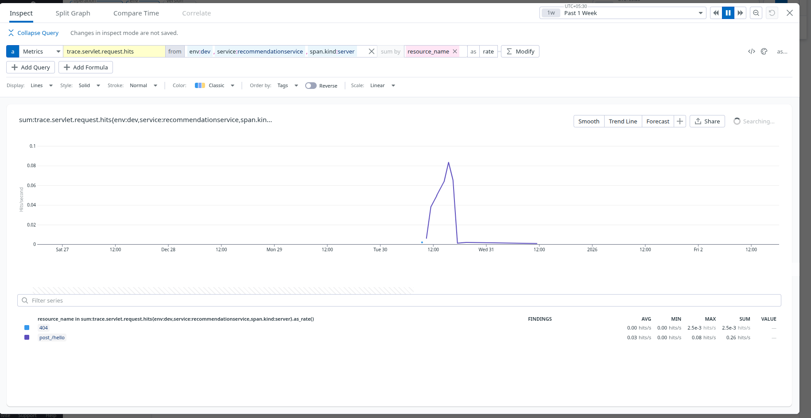

```
{
  expr: [
    `sum(
      trace:servlet:request:hits{
        env:dev,
        service:recommendationservice,
        span.kind:server
      }
    ) by {resource_name}.as_rate()`
  ],
  name: "Request Rate by Endpoint",
  unit: "hits/s",
  type: "Lineplot",
  description: "Request rate (hits per second) for each servlet endpoint, grouped by resource_name, for recommendationservice in the dev environment. This shows traffic patterns and load distribution across endpoints over time."
}
```

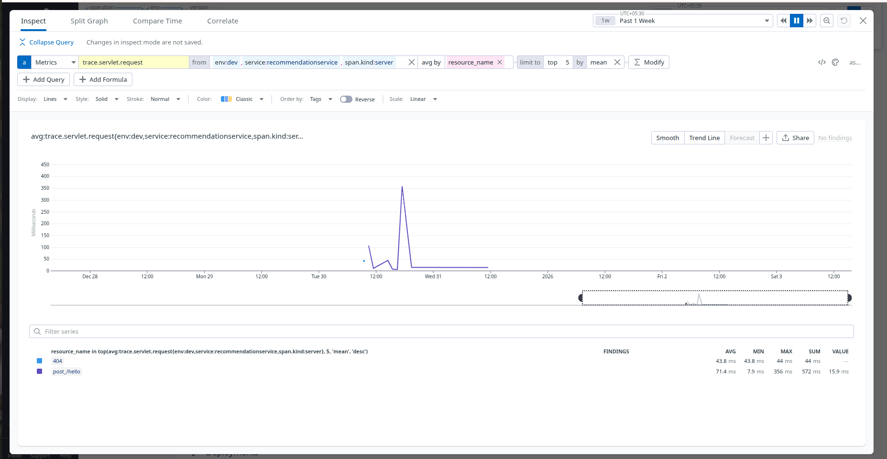

```
{
  expr: [
    `top(
      avg(
        trace:servlet:request{
          env:dev,
          service:recommendationservice,
          span.kind:server
        }
      ) by {resource_name},
      5,
      'mean',
      'desc'
    )`
  ],
  name: "Average Servlet Request Latency by Endpoint",
  unit: "ms",
  type: "Lineplot",
  description: "Average servlet request latency grouped by resource_name (endpoint) for the recommendationservice in the dev environment. Displays the top 5 endpoints ranked by mean latency, helping identify endpoints with higher average response times."
}
```

```
{
  expr: [
    `top(
      p50(
        trace:servlet:request{
          env:dev,
          service:recommendationservice,
          span.kind:server
        }
      ) by {resource_name},
      5,
      'mean',
      'desc'
    )`
  ],
  name: "Median Servlet Request Latency (p50) by Endpoint",
  unit: "ms",
  type: "Lineplot",
  description: "Median (p50) servlet request latency grouped by resource_name (endpoint) for the recommendationservice in the dev environment. Displays the top 5 endpoints ranked by mean latency, helping identify which endpoints typically respond slower under normal conditions."
}

```

```
{
  expr: [
    `top(
      p75(
        trace:servlet:request{
          env:dev,
          service:recommendationservice,
          span.kind:server
        }
      ) by {resource_name},
      5,
      'mean',
      'desc'
    )`
  ],
  name: "Median Servlet Request Latency (p75) by Endpoint",
  unit: "ms",
  type: "Lineplot",
  description: "Median (p75) servlet request latency grouped by resource_name (endpoint) for the recommendationservice in the dev environment. Displays the top 5 endpoints ranked by mean latency, helping identify which endpoints typically respond slower under normal conditions."
}
```

```
{
  expr: [
    `top(
      p90(
        trace:servlet:request{
          env:dev,
          service:recommendationservice,
          span.kind:server
        }
      ) by {resource_name},
      5,
      'mean',
      'desc'
    )`
  ],
  name: "Median Servlet Request Latency (p90) by Endpoint",
  unit: "ms",
  type: "Lineplot",
  description: "Median (p90) servlet request latency grouped by resource_name (endpoint) for the recommendationservice in the dev environment. Displays the top 5 endpoints ranked by mean latency, helping identify which endpoints typically respond slower under normal conditions."
}

```

```
{
  expr: [
    `top(
      p95(
        trace:servlet:request{
          env:dev,
          service:recommendationservice,
          span.kind:server
        }
      ) by {resource_name},
      5,
      'mean',
      'desc'
    )`
  ],
  name: "Median Servlet Request Latency (p95) by Endpoint",
  unit: "ms",
  type: "Lineplot",
  description: "Median (p95) servlet request latency grouped by resource_name (endpoint) for the recommendationservice in the dev environment. Displays the top 5 endpoints ranked by mean latency, helping identify which endpoints typically respond slower under normal conditions."
}

```

```
{
  {
  expr: [
    `top(
      p99(
        trace:servlet:request{
          env:dev,
          service:recommendationservice,
          span.kind:server
        }
      ) by {resource_name},
      5,
      'mean',
      'desc'
    )`
  ],
  name: "Median Servlet Request Latency (p99) by Endpoint",
  unit: "ms",
  type: "Lineplot",
  description: "Median (p99) servlet request latency grouped by resource_name (endpoint) for the recommendationservice in the dev environment. Displays the top 5 endpoints ranked by mean latency, helping identify which endpoints typically respond slower under normal conditions."
}

```

```
{
  expr: [
    `top(
      p99.9(
        trace:servlet:request{
          env:dev,
          service:recommendationservice,
          span.kind:server
        }
      ) by {resource_name},
      5,
      'mean',
      'desc'
    )`
  ],
  name: "Median Servlet Request Latency (p99.9) by Endpoint",
  unit: "ms",
  type: "Lineplot",
  description: "Median (p99.9) servlet request latency grouped by resource_name (endpoint) for the recommendationservice in the dev environment. Displays the top 5 endpoints ranked by mean latency, helping identify which endpoints typically respond slower under normal conditions."
}

```

```
{
  expr: [
    `top(
      max(
        trace:servlet:request{
          env:dev,
          service:recommendationservice,
          span.kind:server
        }
      ) by {resource_name},
      5,
      'mean',
      'desc'
    )`
  ],
  name: "Median Servlet Request Latency (max) by Endpoint",
  unit: "ms",
  type: "Lineplot",
  description: "Median (max) servlet request latency grouped by resource_name (endpoint) for the recommendationservice in the dev environment. Displays the top 5 endpoints ranked by mean latency, helping identify which endpoints typically respond slower under normal conditions."
}
```

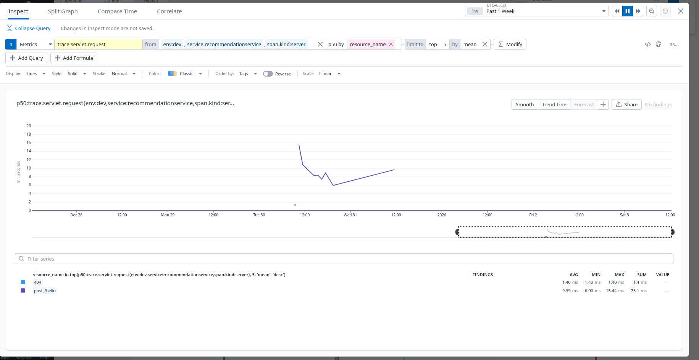

```
{
  expr: [
    `top(
      avg(
        trace:servlet:request{
          env:dev,
          service:recommendationservice,
          span.kind:server
        }
      ) by {resource_name},
      10,
      'mean',
      'desc'
    )`
  ],
  name: "Average Servlet Request Latency by Endpoint",
  unit: "ms",
  type: "Lineplot",
  description: "Average servlet request latency grouped by resource_name (endpoint) for the recommendationservice in the dev environment. Displays the top 10 endpoints ranked by mean latency, helping identify endpoints with higher average response times."
}

```

```
{
  expr: [
    `top(
      p50(
        trace:servlet:request{
          env:dev,
          service:recommendationservice,
          span.kind:server
        }
      ) by {resource_name},
      10,
      'mean',
      'desc'
    )`
  ],
  name: "Median Servlet Request Latency (p50) by Endpoint",
  unit: "ms",
  type: "Lineplot",
  description: "Median (p50) servlet request latency grouped by resource_name (endpoint) for the recommendationservice in the dev environment. Displays the top 10 endpoints ranked by mean latency, helping identify which endpoints typically respond slower under normal conditions."
}

```

```
{
  expr: [
    `top(
      p75(
        trace:servlet:request{
          env:dev,
          service:recommendationservice,
          span.kind:server
        }
      ) by {resource_name},
      10,
      'mean',
      'desc'
    )`
  ],
  name: "Median Servlet Request Latency (p75) by Endpoint",
  unit: "ms",
  type: "Lineplot",
  description: "Median (p75) servlet request latency grouped by resource_name (endpoint) for the recommendationservice in the dev environment. Displays the top 10 endpoints ranked by mean latency, helping identify which endpoints typically respond slower under normal conditions."
}

```

```
{
  expr: [
    `top(
      p90(
        trace:servlet:request{
          env:dev,
          service:recommendationservice,
          span.kind:server
        }
      ) by {resource_name},
      10,
      'mean',
      'desc'
    )`
  ],
  name: "Median Servlet Request Latency (p90) by Endpoint",
  unit: "ms",
  type: "Lineplot",
  description: "Median (p90) servlet request latency grouped by resource_name (endpoint) for the recommendationservice in the dev environment. Displays the top 10 endpoints ranked by mean latency, helping identify which endpoints typically respond slower under normal conditions."
}

```

```
{
  {
  expr: [
    `top(
      p95(
        trace:servlet:request{
          env:dev,
          service:recommendationservice,
          span.kind:server
        }
      ) by {resource_name},
      10,
      'mean',
      'desc'
    )`
  ],
  name: "Median Servlet Request Latency (p95) by Endpoint",
  unit: "ms",
  type: "Lineplot",
  description: "Median (p95) servlet request latency grouped by resource_name (endpoint) for the recommendationservice in the dev environment. Displays the top 10 endpoints ranked by mean latency, helping identify which endpoints typically respond slower under normal conditions."
}

```

```
{
  expr: [
    `top(
      p99(
        trace:servlet:request{
          env:dev,
          service:recommendationservice,
          span.kind:server
        }
      ) by {resource_name},
      10,
      'mean',
      'desc'
    )`
  ],
  name: "Median Servlet Request Latency (p99) by Endpoint",
  unit: "ms",
  type: "Lineplot",
  description: "Median (p99) servlet request latency grouped by resource_name (endpoint) for the recommendationservice in the dev environment. Displays the top 10 endpoints ranked by mean latency, helping identify which endpoints typically respond slower under normal conditions."
}

```

```
{
  expr: [
    `top(
      p99.9(
        trace:servlet:request{
          env:dev,
          service:recommendationservice,
          span.kind:server
        }
      ) by {resource_name},
      10,
      'mean',
      'desc'
    )`
  ],
  name: "Median Servlet Request Latency (p99.9) by Endpoint",
  unit: "ms",
  type: "Lineplot",
  description: "Median (p99.9) servlet request latency grouped by resource_name (endpoint) for the recommendationservice in the dev environment. Displays the top 10 endpoints ranked by mean latency, helping identify which endpoints typically respond slower under normal conditions."
}

```

```
{
  expr: [
    `top(
      max(
        trace:servlet:request{
          env:dev,
          service:recommendationservice,
          span.kind:server
        }
      ) by {resource_name},
      10,
      'mean',
      'desc'
    )`
  ],
  name: "Median Servlet Request Latency (max) by Endpoint",
  unit: "ms",
  type: "Lineplot",
  description: "Median (max) servlet request latency grouped by resource_name (endpoint) for the recommendationservice in the dev environment. Displays the top 10 endpoints ranked by mean latency, helping identify which endpoints typically respond slower under normal conditions."
}
```

```
{
  expr: [
    `avg(
      trace:servlet:request{
        env:dev,
        service:recommendationservice,
        span.kind:server
      }
    ) by {resource_name}`
  ],
  name: "Average Servlet Request Latency by Endpoint",
  unit: "ms",
  type: "Lineplot",
  description: "Line plot showing the average servlet request latency grouped by resource_name (endpoint) for the recommendationservice in the dev environment. Each line represents an endpoint, allowing comparison of average response times over the selected time range."
}
```

```
{
  expr: [
    `p50(
      trace:servlet:request{
        env:dev,
        service:recommendationservice,
        span.kind:server
      }
    ) by {resource_name}`
  ],
  name: "Average Servlet Request Latency(p50) by Endpoint",
  unit: "ms",
  type: "Lineplot",
  description: "Line plot showing the average servlet request latency grouped by resource_name (endpoint) for the recommendationservice in the dev environment. Each line represents an endpoint, allowing comparison of average response times over the selected time range."
}
```

```
{
  expr: [
    `p75(
      trace:servlet:request{
        env:dev,
        service:recommendationservice,
        span.kind:server
      }
    ) by {resource_name}`
  ],
  name: "Average Servlet Request Latency(p75) by Endpoint",
  unit: "ms",
  type: "Lineplot",
  description: "Line plot showing the average servlet request latency grouped by resource_name (endpoint) for the recommendationservice in the dev environment. Each line represents an endpoint, allowing comparison of average response times over the selected time range."
}
```

```
{
  expr: [
    `p90(
      trace:servlet:request{
        env:dev,
        service:recommendationservice,
        span.kind:server
      }
    ) by {resource_name}`
  ],
  name: "Average Servlet Request Latency(p90) by Endpoint",
  unit: "ms",
  type: "Lineplot",
  description: "Line plot showing the average servlet request latency grouped by resource_name (endpoint) for the recommendationservice in the dev environment. Each line represents an endpoint, allowing comparison of average response times over the selected time range."
}
```

```
{
  expr: [
    `p95(
      trace:servlet:request{
        env:dev,
        service:recommendationservice,
        span.kind:server
      }
    ) by {resource_name}`
  ],
  name: "Average Servlet Request Latency(p95) by Endpoint",
  unit: "ms",
  type: "Lineplot",
  description: "Line plot showing the average servlet request latency grouped by resource_name (endpoint) for the recommendationservice in the dev environment. Each line represents an endpoint, allowing comparison of average response times over the selected time range."
}
```

```
{
  expr: [
    `p99(
      trace:servlet:request{
        env:dev,
        service:recommendationservice,
        span.kind:server
      }
    ) by {resource_name}`
  ],
  name: "Average Servlet Request Latency(p99) by Endpoint",
  unit: "ms",
  type: "Lineplot",
  description: "Line plot showing the average servlet request latency grouped by resource_name (endpoint) for the recommendationservice in the dev environment. Each line represents an endpoint, allowing comparison of average response times over the selected time range."
}
```

```
{
  expr: [
    `p99.9(
      trace:servlet:request{
        env:dev,
        service:recommendationservice,
        span.kind:server
      }
    ) by {resource_name}`
  ],
  name: "Average Servlet Request Latency(p99.9) by Endpoint",
  unit: "ms",
  type: "Lineplot",
  description: "Line plot showing the average servlet request latency grouped by resource_name (endpoint) for the recommendationservice in the dev environment. Each line represents an endpoint, allowing comparison of average response times over the selected time range."
}
```

```
{
  expr: [
    `max(
      trace:servlet:request{
        env:dev,
        service:recommendationservice,
        span.kind:server
      }
    ) by {resource_name}`
  ],
  name: "Average Servlet Request Latency(max) by Endpoint",
  unit: "ms",
  type: "Lineplot",
  description: "Line plot showing the average servlet request latency grouped by resource_name (endpoint) for the recommendationservice in the dev environment. Each line represents an endpoint, allowing comparison of average response times over the selected time range."
}
```

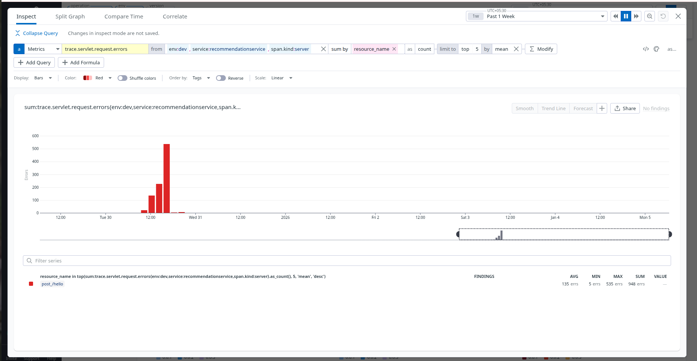

```
{
  expr: [
    `top(
      sum(
        trace:servlet:request.errors{
          env:dev,
          service:recommendationservice,
          span.kind:server
        }
      ) by {resource_name},
      5,
      'mean',
      'desc'
    )`
  ],
  name: "Servlet Request Errors by Endpoint (Top 5)",
  unit: "errors",
  type: "Bar",
  description: "Sum of servlet request errors grouped by resource_name (endpoint) for the recommendationservice in the dev environment. Displays the top 5 endpoints ranked by mean error count to highlight the most error-prone endpoints."
}
```

```
{
  expr: [
    `top(
      sum(
        trace:servlet:request.errors{
          env:dev,
          service:recommendationservice,
          span.kind:server
        }
      ) by {resource_name},
      10,
      'mean',
      'desc'
    )`
  ],
  name: "Servlet Request Errors by Endpoint (Top 10)",
  unit: "errors",
  type: "Bar",
  description: "Sum of servlet request errors grouped by resource_name (endpoint) for the recommendationservice in the dev environment. Displays the top 10 endpoints ranked by mean error count to highlight endpoints with frequent failures."
}
```

```
{
  expr: [
    `sum(
      trace:servlet:request.errors{
        env:dev,
        service:recommendationservice,
        span.kind:server
      }
    ) by {resource_name}`
  ],
  name: "Servlet Request Errors by Endpoint (All)",
  unit: "errors",
  type: "Bar",
  description: "Sum of servlet request errors grouped by resource_name (endpoint) for the recommendationservice in the dev environment. Displays error counts for all endpoints without applying a ranking limit."
}
```

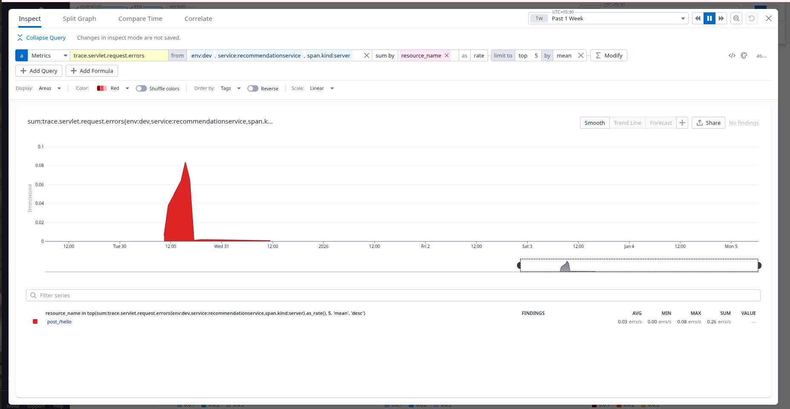

```
{
  expr: [
    `top(
      sum(
        trace:servlet:request.errors{
          env:dev,
          service:recommendationservice,
          span.kind:server
        }
      ).as_rate() by {resource_name},
      5,
      'mean',
      'desc'
    )`
  ],
  name: "Servlet Request Error Rate by Endpoint (Top 5)",
  unit: "errors/s",
  type: "Areaplot",
  description: "Servlet request error rate grouped by resource_name (endpoint) for the recommendationservice in the dev environment. Displays the top 5 endpoints ranked by mean error rate, highlighting endpoints with the highest frequency of failures."
}
```

```
{
  expr: [
    `top(
      sum(
        trace:servlet:request.errors{
          env:dev,
          service:recommendationservice,
          span.kind:server
        }
      ).as_rate() by {resource_name},
      10,
      'mean',
      'desc'
    )`
  ],
  name: "Servlet Request Error Rate by Endpoint (Top 10)",
  unit: "errors/s",
  type: "Areaplot",
  description: "Servlet request error rate grouped by resource_name (endpoint) for the recommendationservice in the dev environment. Displays the top 10 endpoints ranked by mean error rate to identify endpoints with elevated failure rates."
}
```

```
{
  expr: [
    `sum(
      trace:servlet:request.errors{
        env:dev,
        service:recommendationservice,
        span.kind:server
      }
    ).as_rate() by {resource_name}`
  ],
  name: "Servlet Request Error Rate by Endpoint (All)",
  unit: "errors/s",
  type: "Areaplot",
  description: "Servlet request error rate grouped by resource_name (endpoint) for the recommendationservice in the dev environment. Displays error rates for all endpoints without applying a ranking limit."
}
```

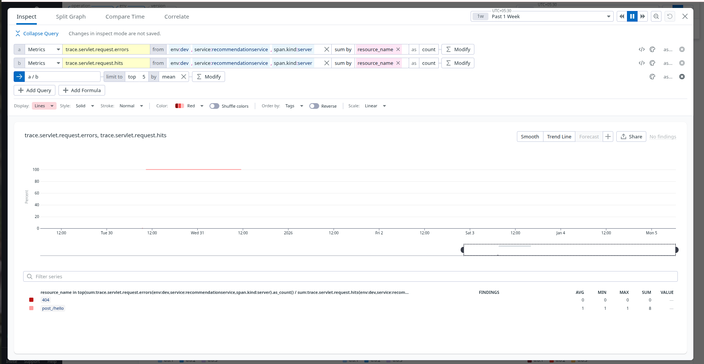

```
{
  expr: [
    `top(
      (
        sum(
          trace:servlet:request.errors{
            env:dev,
            service:recommendationservice,
            span.kind:server
          }
        ).as_count()
        /
        sum(
          trace:servlet:request.hits{
            env:dev,
            service:recommendationservice,
            span.kind:server
          }
        ).as_count()
      ) * 100 by {resource_name},
      5,
      'mean',
      'desc'
    )`
  ],
  name: "Servlet Request Error Percentage by Endpoint (Top 5)",
  unit: "%",
  type: "Lineplot",
  description: "Percentage of servlet requests resulting in errors, calculated as errors divided by total hits and grouped by resource_name (endpoint) for the recommendationservice in the dev environment. Displays the top 5 endpoints ranked by mean error percentage."
}
```

```
{
  expr: [
    `top(
      (
        sum(
          trace:servlet:request.errors{
            env:dev,
            service:recommendationservice,
            span.kind:server
          }
        ).as_count()
        /
        sum(
          trace:servlet:request.hits{
            env:dev,
            service:recommendationservice,
            span.kind:server
          }
        ).as_count()
      ) * 100 by {resource_name},
      10,
      'mean',
      'desc'
    )`
  ],
  name: "Servlet Request Error Percentage by Endpoint (Top 10)",
  unit: "%",
  type: "Lineplot",
  description: "Percentage of servlet requests resulting in errors, calculated as errors divided by total hits and grouped by resource_name (endpoint) for the recommendationservice in the dev environment. Displays the top 10 endpoints ranked by mean error percentage."
}
```

```
{
  expr: [
    `(
      sum(
        trace:servlet:request.errors{
          env:dev,
          service:recommendationservice,
          span.kind:server
        }
      ).as_count()
      /
      sum(
        trace:servlet:request.hits{
          env:dev,
          service:recommendationservice,
          span.kind:server
        }
      ).as_count()
    ) * 100 by {resource_name}`
  ],
  name: "Servlet Request Error Percentage by Endpoint (All)",
  unit: "%",
  type: "Lineplot",
  description: "Percentage of servlet requests resulting in errors, calculated as errors divided by total hits and grouped by resource_name (endpoint) for the recommendationservice in the dev environment. Displays error percentages for all endpoints without applying a ranking limit."
}
```

# Deployments

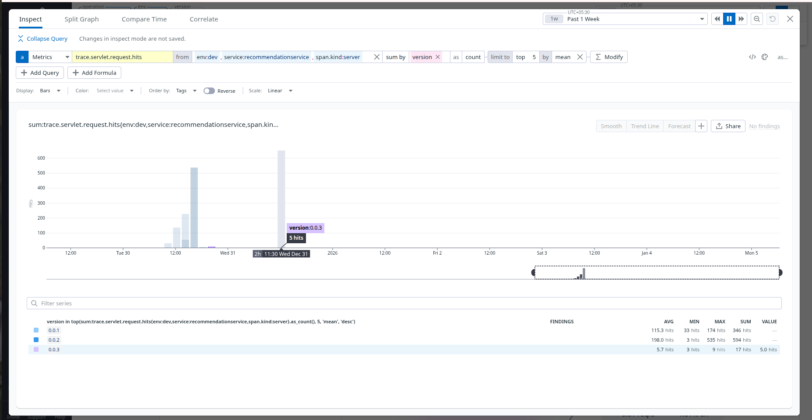

```
{
  expr: [
    `top(
      sum(
        trace:servlet:request.hits{
          env:dev,
          service:recommendationservice,
          span.kind:server
        }
      ).as_count() by {version},
      5,
      'mean',
      'desc'
    )`
  ],
  name: "Servlet Request Hits by Version (Top 5)",
  unit: "hits",
  type: "Bar",
  description: "Total servlet request hits grouped by version for the recommendationservice in the dev environment. Displays the top 5 versions ranked by mean request volume, helping compare traffic distribution across deployments."
}
```

```
{
  expr: [
    `top(
      sum(
        trace:servlet:request.hits{
          env:dev,
          service:recommendationservice,
          span.kind:server
        }
      ).as_count() by {version},
      10,
      'mean',
      'desc'
    )`
  ],
  name: "Servlet Request Hits by Version (Top 10)",
  unit: "hits",
  type: "Bar",
  description: "Total servlet request hits grouped by version for the recommendationservice in the dev environment. Displays the top 10 versions ranked by mean request volume, helping analyze traffic spread across multiple releases."
}
```

```
{
  expr: [
    `sum(
      trace:servlet:request.hits{
        env:dev,
        service:recommendationservice,
        span.kind:server
      }
    ).as_count() by {version}`
  ],
  name: "Servlet Request Hits by Version (All)",
  unit: "hits",
  type: "Bar",
  description: "Total servlet request hits grouped by version for the recommendationservice in the dev environment. Displays request volume for all versions without applying a ranking limit."
}
```

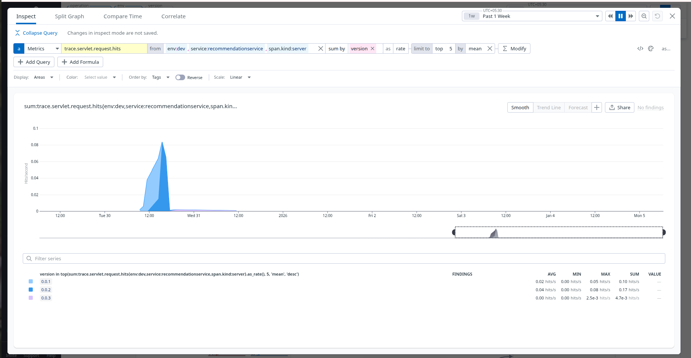

```
{
  expr: [
    `top(
      sum(
        trace:servlet:request.hits{
          env:dev,
          service:recommendationservice,
          span.kind:server
        }
      ).as_rate() by {version},
      5,
      'mean',
      'desc'
    )`
  ],
  name: "Servlet Request Hit Rate by Version (Top 5)",
  unit: "hits/s",
  type: "Area",
  description: "Servlet request hit rate grouped by version for the recommendationservice in the dev environment. Displays the top 5 versions ranked by mean hit rate, helping identify versions receiving the highest traffic."
}
```

```
{
  expr: [
    `top(
      sum(
        trace:servlet:request.hits{
          env:dev,
          service:recommendationservice,
          span.kind:server
        }
      ).as_rate() by {version},
      10,
      'mean',
      'desc'
    )`
  ],
  name: "Servlet Request Hit Rate by Version (Top 10)",
  unit: "hits/s",
  type: "Area",
  description: "Servlet request hit rate grouped by version for the recommendationservice in the dev environment. Displays the top 10 versions ranked by mean hit rate, helping analyze traffic distribution across multiple releases."
}
```

```
{
  expr: [
    `sum(
      trace:servlet:request.hits{
        env:dev,
        service:recommendationservice,
        span.kind:server
      }
    ).as_rate() by {version}`
  ],
  name: "Servlet Request Hit Rate by Version (All)",
  unit: "hits/s",
  type: "Area",
  description: "Servlet request hit rate grouped by version for the recommendationservice in the dev environment. Displays hit rate for all versions without applying any ranking limit."
}
```

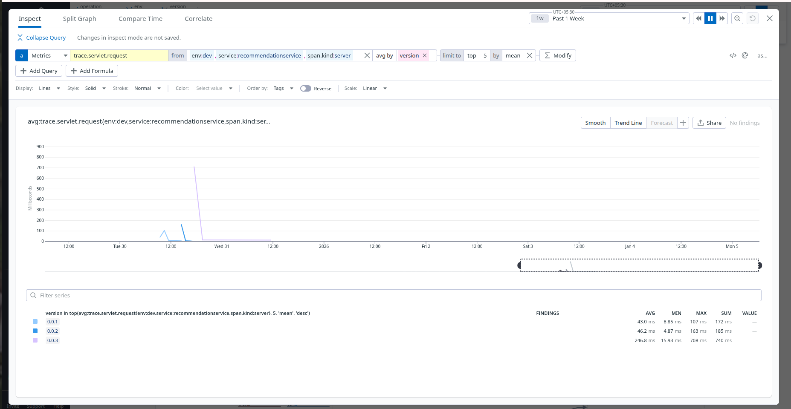

```
{
  expr: [
    `top(
      avg(
        trace:servlet:request{
          env:dev,
          service:recommendationservice,
          span.kind:server
        }
      ) by {version},
      5,
      'mean',
      'desc'
    )`
  ],
  name: "Average Servlet Request Latency by Version (Top 5)",
  unit: "ms",
  type: "Lineplot",
  description: "Average servlet request latency grouped by version. Top 5 versions ranked by mean latency."
}
```

```
{
  expr: [
    `top(
      avg(
        trace:servlet:request{
          env:dev,
          service:recommendationservice,
          span.kind:server
        }
      ) by {version},
      10,
      'mean',
      'desc'
    )`
  ],
  name: "Average Servlet Request Latency by Version (Top 10)",
  unit: "ms",
  type: "Lineplot",
  description: "Average servlet request latency grouped by version. Top 10 versions ranked by mean latency."
}
```

```
{
  expr: [
    `avg(
      trace:servlet:request{
        env:dev,
        service:recommendationservice,
        span.kind:server
      }
    ) by {version}`
  ],
  name: "Average Servlet Request Latency by Version (All)",
  unit: "ms",
  type: "Lineplot",
  description: "Average servlet request latency grouped by version for all versions."
}
```

```
{
  expr: [
    `top(
      p50(
        trace:servlet:request{
          env:dev,
          service:recommendationservice,
          span.kind:server
        }
      ) by {version},
      5,
      'mean',
      'desc'
    )`
  ],
  name: "P50 Servlet Request Latency by Version (Top 5)",
  unit: "ms",
  type: "Lineplot",
  description: "P50 servlet request latency grouped by version. Top 5 versions ranked by mean latency."
}
```

```
{
  expr: [
    `top(
      p50(
        trace:servlet:request{
          env:dev,
          service:recommendationservice,
          span.kind:server
        }
      ) by {version},
      10,
      'mean',
      'desc'
    )`
  ],
  name: "P50 Servlet Request Latency by Version (Top 10)",
  unit: "ms",
  type: "Lineplot",
  description: "P50 servlet request latency grouped by version. Top 10 versions ranked by mean latency."
}
```

```
{
  expr: [
    `p50(
      trace:servlet:request{
        env:dev,
        service:recommendationservice,
        span.kind:server
      }
    ) by {version}`
  ],
  name: "P50 Servlet Request Latency by Version (All)",
  unit: "ms",
  type: "Lineplot",
  description: "P50 servlet request latency grouped by version for all versions."
}
```

```
{
  expr: [
    `top(
      p75(
        trace:servlet:request{
          env:dev,
          service:recommendationservice,
          span.kind:server
        }
      ) by {version},
      5,
      'mean',
      'desc'
    )`
  ],
  name: "P75 Servlet Request Latency by Version (Top 5)",
  unit: "ms",
  type: "Lineplot",
  description: "P75 servlet request latency grouped by version. Top 5 versions ranked by mean latency."
}
```

```
{
  expr: [
    `top(
      p75(
        trace:servlet:request{
          env:dev,
          service:recommendationservice,
          span.kind:server
        }
      ) by {version},
      10,
      'mean',
      'desc'
    )`
  ],
  name: "P75 Servlet Request Latency by Version (Top 10)",
  unit: "ms",
  type: "Lineplot",
  description: "P75 servlet request latency grouped by version. Top 10 versions ranked by mean latency."
}
```

```
{
  expr: [
    `p75(
      trace:servlet:request{
        env:dev,
        service:recommendationservice,
        span.kind:server
      }
    ) by {version}`
  ],
  name: "P75 Servlet Request Latency by Version (All)",
  unit: "ms",
  type: "Lineplot",
  description: "P75 servlet request latency grouped by version for all versions."
}
```

```
{
  expr: [
    `top(
      p90(
        trace:servlet:request{
          env:dev,
          service:recommendationservice,
          span.kind:server
        }
      ) by {version},
      5,
      'mean',
      'desc'
    )`
  ],
  name: "P90 Servlet Request Latency by Version (Top 5)",
  unit: "ms",
  type: "Lineplot",
  description: "P90 servlet request latency grouped by version. Top 5 versions ranked by mean latency."
}
```

```
{
  expr: [
    `top(
      p90(
        trace:servlet:request{
          env:dev,
          service:recommendationservice,
          span.kind:server
        }
      ) by {version},
      10,
      'mean',
      'desc'
    )`
  ],
  name: "P90 Servlet Request Latency by Version (Top 10)",
  unit: "ms",
  type: "Lineplot",
  description: "P90 servlet request latency grouped by version. Top 10 versions ranked by mean latency."
}
```

```
{
  expr: [
    `p90(
      trace:servlet:request{
        env:dev,
        service:recommendationservice,
        span.kind:server
      }
    ) by {version}`
  ],
  name: "P90 Servlet Request Latency by Version (All)",
  unit: "ms",
  type: "Lineplot",
  description: "P90 servlet request latency grouped by version for all versions."
}
```

```
{
  expr: [
    `top(
      p95(
        trace:servlet:request{
          env:dev,
          service:recommendationservice,
          span.kind:server
        }
      ) by {version},
      5,
      'mean',
      'desc'
    )`
  ],
  name: "P95 Servlet Request Latency by Version (Top 5)",
  unit: "ms",
  type: "Lineplot",
  description: "P95 servlet request latency grouped by version. Top 5 versions ranked by mean latency."
}
```

```
{
  expr: [
    `top(
      p90(
        trace:servlet:request{
          env:dev,
          service:recommendationservice,
          span.kind:server
        }
      ) by {version},
      10,
      'mean',
      'desc'
    )`
  ],
  name: "P90 Servlet Request Latency by Version (Top 10)",
  unit: "ms",
  type: "Lineplot",
  description: "P90 servlet request latency grouped by version. Top 10 versions ranked by mean latency."
}
```

```
{
  expr: [
    `p90(
      trace:servlet:request{
        env:dev,
        service:recommendationservice,
        span.kind:server
      }
    ) by {version}`
  ],
  name: "P90 Servlet Request Latency by Version (All)",
  unit: "ms",
  type: "Lineplot",
  description: "P90 servlet request latency grouped by version for all versions."
}
```

```
{
  expr: [
    `top(
      p95(
        trace:servlet:request{
          env:dev,
          service:recommendationservice,
          span.kind:server
        }
      ) by {version},
      5,
      'mean',
      'desc'
    )`
  ],
  name: "P95 Servlet Request Latency by Version (Top 5)",
  unit: "ms",
  type: "Lineplot",
  description: "P95 servlet request latency grouped by version. Top 5 versions ranked by mean latency."
}
```

```
{
  expr: [
    `top(
      p95(
        trace:servlet:request{
          env:dev,
          service:recommendationservice,
          span.kind:server
        }
      ) by {version},
      10,
      'mean',
      'desc'
    )`
  ],
  name: "P95 Servlet Request Latency by Version (Top 10)",
  unit: "ms",
  type: "Lineplot",
  description: "P95 servlet request latency grouped by version. Top 10 versions ranked by mean latency."
}
```

```
{
  expr: [
    `p95(
      trace:servlet:request{
        env:dev,
        service:recommendationservice,
        span.kind:server
      }
    ) by {version}`
  ],
  name: "P95 Servlet Request Latency by Version (All)",
  unit: "ms",
  type: "Lineplot",
  description: "P95 servlet request latency grouped by version for all versions."
}
```

```
{
  expr: [
    `top(
      p99(
        trace:servlet:request{
          env:dev,
          service:recommendationservice,
          span.kind:server
        }
      ) by {version},
      5,
      'mean',
      'desc'
    )`
  ],
  name: "P99 Servlet Request Latency by Version (Top 5)",
  unit: "ms",
  type: "Lineplot",
  description: "P99 servlet request latency grouped by version. Top 5 versions ranked by mean latency."
}
```

```
{
  expr: [
    `top(
      p99(
        trace:servlet:request{
          env:dev,
          service:recommendationservice,
          span.kind:server
        }
      ) by {version},
      10,
      'mean',
      'desc'
    )`
  ],
  name: "P99 Servlet Request Latency by Version (Top 10)",
  unit: "ms",
  type: "Lineplot",
  description: "P99 servlet request latency grouped by version. Top 10 versions ranked by mean latency."
}
```

```
{
  expr: [
    `p99(
      trace:servlet:request{
        env:dev,
        service:recommendationservice,
        span.kind:server
      }
    ) by {version}`
  ],
  name: "P99 Servlet Request Latency by Version (All)",
  unit: "ms",
  type: "Lineplot",
  description: "P99 servlet request latency grouped by version for all versions."
}
```

```
{
  expr: [
    `top(
      p99.9(
        trace:servlet:request{
          env:dev,
          service:recommendationservice,
          span.kind:server
        }
      ) by {version},
      5,
      'mean',
      'desc'
    )`
  ],
  name: "P99.9 Servlet Request Latency by Version (Top 5)",
  unit: "ms",
  type: "Lineplot",
  description: "P99.9 servlet request latency grouped by version. Top 5 versions ranked by mean latency."
}
```

```
{
  expr: [
    `top(
      p99.9(
        trace:servlet:request{
          env:dev,
          service:recommendationservice,
          span.kind:server
        }
      ) by {version},
      10,
      'mean',
      'desc'
    )`
  ],
  name: "P99.9 Servlet Request Latency by Version (Top 10)",
  unit: "ms",
  type: "Lineplot",
  description: "P99.9 servlet request latency grouped by version. Top 10 versions ranked by mean latency."
}
```

```
{
  expr: [
    `p99.9(
      trace:servlet:request{
        env:dev,
        service:recommendationservice,
        span.kind:server
      }
    ) by {version}`
  ],
  name: "P99.9 Servlet Request Latency by Version (All)",
  unit: "ms",
  type: "Lineplot",
  description: "P99.9 servlet request latency grouped by version for all versions."
}
```

```
{
  expr: [
    `top(
      max(
        trace:servlet:request{
          env:dev,
          service:recommendationservice,
          span.kind:server
        }
      ) by {version},
      5,
      'mean',
      'desc'
    )`
  ],
  name: "Max Servlet Request Latency by Version (Top 5)",
  unit: "ms",
  type: "Lineplot",
  description: "Max servlet request latency grouped by version. Top 5 versions ranked by mean latency."
}
```

```
{
  expr: [
    `top(
      max(
        trace:servlet:request{
          env:dev,
          service:recommendationservice,
          span.kind:server
        }
      ) by {version},
      10,
      'mean',
      'desc'
    )`
  ],
  name: "Max Servlet Request Latency by Version (Top 10)",
  unit: "ms",
  type: "Lineplot",
  description: "Max servlet request latency grouped by version. Top 10 versions ranked by mean latency."
}
```

```
{
  expr: [
    `max(
      trace:servlet:request{
        env:dev,
        service:recommendationservice,
        span.kind:server
      }
    ) by {version}`
  ],
  name: "Max Servlet Request Latency by Version (All)",
  unit: "ms",
  type: "Lineplot",
  description: "Max servlet request latency grouped by version for all versions."
}
```

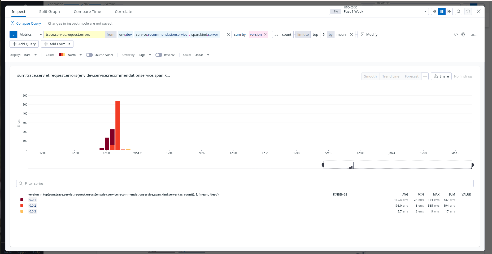

```
{
  expr: [
    `top(
      sum(
        trace:servlet:request.errors{
          env:dev,
          service:recommendationservice,
          span.kind:server
        }
      ) by {version}.as_count(),
      5,
      'mean',
      'desc'
    )`
  ],
  name: "Servlet Request Errors by Version (Top 5)",
  unit: "errors",
  type: "Bar",
  description: "Total servlet request errors grouped by version. Displays the top 5 versions ranked by mean error count."
}
```

```
{
  expr: [
    `top(
      sum(
        trace:servlet:request.errors{
          env:dev,
          service:recommendationservice,
          span.kind:server
        }
      ) by {version}.as_count(),
      10,
      'mean',
      'desc'
    )`
  ],
  name: "Servlet Request Errors by Version (Top 10)",
  unit: "errors",
  type: "Bar",
  description: "Total servlet request errors grouped by version. Displays the top 10 versions ranked by mean error count."
}
```

```
{
  expr: [
    `sum(
      trace:servlet:request.errors{
        env:dev,
        service:recommendationservice,
        span.kind:server
      }
    ) by {version}.as_count()`
  ],
  name: "Servlet Request Errors by Version (All)",
  unit: "errors",
  type: "Bar",
  description: "Total servlet request errors grouped by version for all versions."
}
```

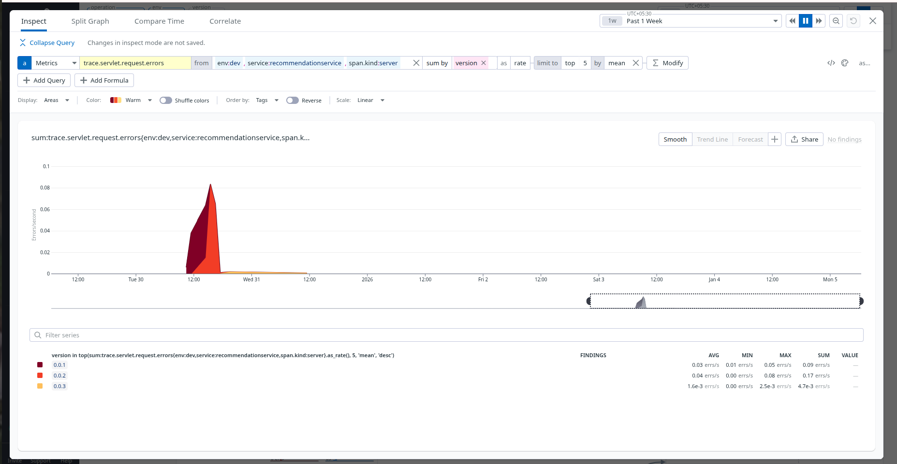

```
{
  expr: [
    `top(
      sum(
        trace:servlet:request.errors{
          env:dev,
          service:recommendationservice,
          span.kind:server
        }
      ) by {version}.as_rate(),
      5,
      'mean',
      'desc'
    )`
  ],
  name: "Servlet Request Error Rate by Version (Top 5)",
  unit: "errors/s",
  type: "Area",
  description: "Servlet request error rate grouped by version. Displays the top 5 versions ranked by mean error rate."
}
```

```
{
  expr: [
    `top(
      sum(
        trace:servlet:request.errors{
          env:dev,
          service:recommendationservice,
          span.kind:server
        }
      ) by {version}.as_rate(),
      10,
      'mean',
      'desc'
    )`
  ],
  name: "Servlet Request Error Rate by Version (Top 10)",
  unit: "errors/s",
  type: "Area",
  description: "Servlet request error rate grouped by version. Displays the top 10 versions ranked by mean error rate."
}
```

```
{
  expr: [
    `sum(
      trace:servlet:request.errors{
        env:dev,
        service:recommendationservice,
        span.kind:server
      }
    ) by {version}.as_rate()`
  ],
  name: "Servlet Request Error Rate by Version (All)",
  unit: "errors/s",
  type: "Area",
  description: "Servlet request error rate grouped by version for all versions."
}
```

# Kubernetes metrics

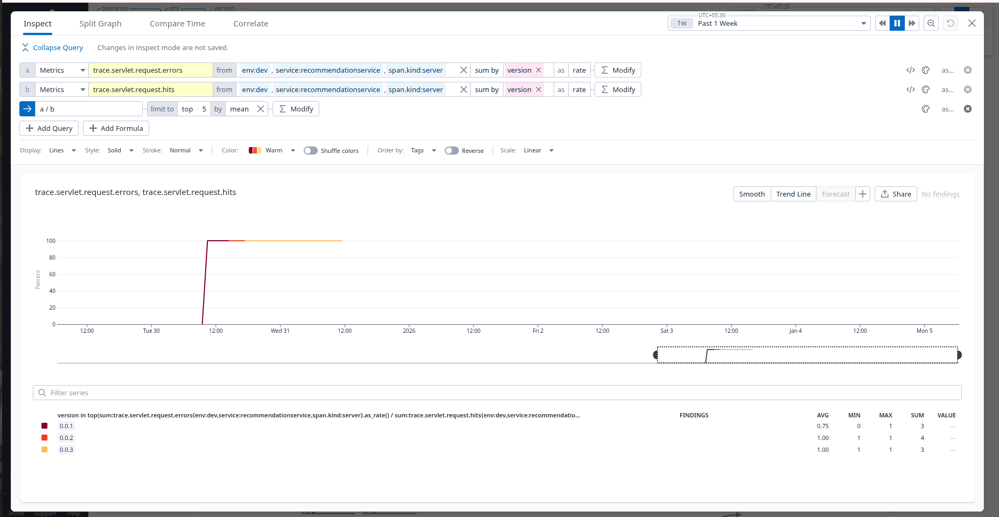

```
{
  expr: [
    `(
      sum(
        trace:servlet:request.errors{
          env:dev,
          service:recommendationservice,
          span.kind:server
        }
      ) by {version}.as_rate()
      /
      sum(
        trace:servlet:request.hits{
          env:dev,
          service:recommendationservice,
          span.kind:server
        }
      ) by {version}.as_rate()
    ) * 100`
  ],
  name: "Servlet Request Error Percentage by Version (Top 5)",
  unit: "percent",
  type: "Lineplot",
  description: "Servlet request error percentage (errors divided by hits) grouped by version. Displays the top 5 versions ranked by mean error percentage."
}
```

```
{
  expr: [
    `(
      sum(
        trace:servlet:request.errors{
          env:dev,
          service:recommendationservice,
          span.kind:server
        }
      ) by {version}.as_rate()
      /
      sum(
        trace:servlet:request.hits{
          env:dev,
          service:recommendationservice,
          span.kind:server
        }
      ) by {version}.as_rate()
    ) * 100`
  ],
  name: "Servlet Request Error Percentage by Version (Top 10)",
  unit: "percent",
  type: "Lineplot",
  description: "Servlet request error percentage (errors divided by hits) grouped by version. Displays the top 10 versions ranked by mean error percentage."
}
```

```
{
  expr: [
    `(
      sum(
        trace:servlet:request.errors{
          env:dev,
          service:recommendationservice,
          span.kind:server
        }
      ) by {version}.as_rate()
      /
      sum(
        trace:servlet:request.hits{
          env:dev,
          service:recommendationservice,
          span.kind:server
        }
      ) by {version}.as_rate()
    ) * 100`
  ],
  name: "Servlet Request Error Percentage by Version (All)",
  unit: "percent",
  type: "Lineplot",
  description: "Servlet request error percentage (errors divided by hits) grouped by version for all versions."
}
```

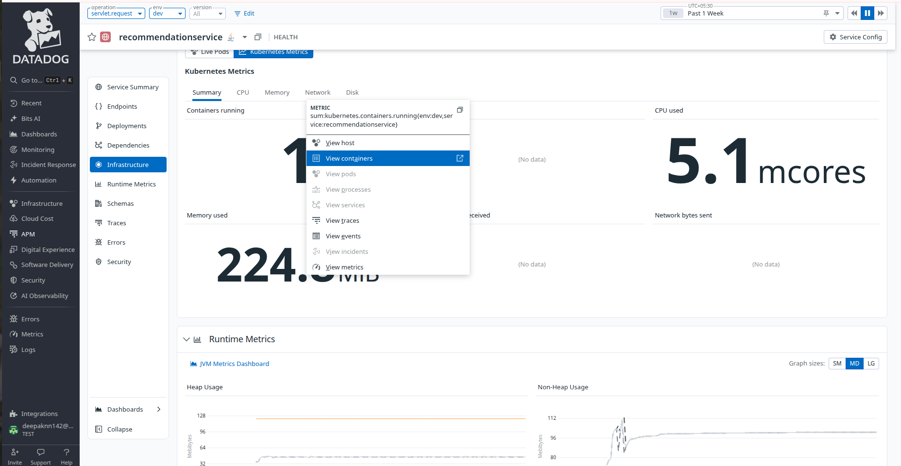

```
{
  expr: [
    `sum(
      kubernetes:containers:running{
        env:dev,
        service:recommendationservice
      }
    )`
  ],
  name: "Containers Running",
  unit: "containers",
  type: "counter",
  description: "Total number of Kubernetes containers currently running for the recommendationservice in the dev environment."
}
```

```
{
  expr: [
    `sum(kubernetes:pods:running{env:dev,service:recommendationservice})`
  ],
  name: "Pods Running",
  unit: " ",
  type: "counter",
  description: "Total number of Kubernetes pods currently running for the recommendationservice in the dev environment."
}
```

```
{
  expr: [
    `sum(kubernetes:cpu:usage:total{env:dev,service:recommendationservice})`
  ],
  name: "CPU used",
  unit: "mcores",
  type: "counter",
  description: "Total cpu for the recommendationservice in the dev environment."
}
```

```
{
  expr: [
    `sum(kubernetes:memory:usage{env:dev,service:recommendationservice})`
  ],
  name: "Memory used",
  unit: "MiB",
  type: "counter",
  description: "Total memory for the recommendationservice in the dev environment."
}
```

```
{
  expr: [
    `sum(kubernetes:network:rx_bytes{env:dev,service:recommendationservice})`
  ],
  name: "Network Bytes recieved",
  unit: "",
  type: "counter",
  description: "Total network bytes  recieved for the recommendationservice in the dev environment."
}
```

```
{
  expr: [
    `sum(kubernetes:network:tx_bytes{env:dev,service:recommendationservice})`
  ],
  name: "Network Bytes sent",
  unit: "",
  type: "counter",
  description: "Total network bytes for the sent recommendationservice in the dev environment."
}
```

# Runtime metrics

## Non-Heap Usage (top 10)

```
{
  expr: [
    `top(
      avg(jvm:non_heap_memory{
        env:dev,
        service:recommendationservice
      })by {runtime-id},
      10,
      'mean',
      'desc'
    )`
  ],
  name: "JVM Non-Heap Memory Usage (Top 10 Runtimes)",
  unit: "MiB",
  type: "Line",
  description: "Average JVM non-heap memory usage grouped by runtime-id, showing the top 10 runtimes by mean value for the recommendationservice in the dev environment."
}
```

## GC old gen size(10)

```
{
  expr: [
    `top(
      avg(jvm:gc:old_gen_size{
        env:dev,
        service:recommendationservice
      } )by {runtime-id},
      10,
      'mean',
      'desc'
    )`
  ],
  name: "JVM GC Old Gen Size (Top 10 Runtimes)",
  unit: "bytes",
  type: "Line",
  description: "Average JVM GC old generation size grouped by runtime-id, showing the top 10 runtimes by mean value for the recommendationservice in the dev environment."
}
```

## GC New Gen Size (top 10)

```
{
  expr: [
    `top(
      avg(jvm:gc:eden_size{
        env:dev,
        service:recommendationservice
      }) by {runtime-id},
      10,
      'mean',
      'desc'
    )`
  ],
  name: "JVM GC New Gen (Eden) Size (Top 10 Runtimes)",
  unit: "bytes",
  type: "Line",
  description: "Average JVM GC Eden (new generation) size grouped by runtime-id, showing the top 10 runtimes by mean value for the recommendationservice in the dev environment."
}
```

## Number of Classes Loaded (top 10)

```
{
  expr: [
    `top(
      avg(jvm:loaded_classes{
        env:dev,
        service:recommendationservice
      } )by {runtime-id},
      10,
      'mean',
      'desc'
    )`
  ],
  name: "JVM Loaded Classes (Top 10 Runtimes)",
  unit: "count",
  type: "Area",
  description: "Average number of JVM classes loaded grouped by runtime-id, showing the top 10 runtimes by mean value for the recommendationservice in the dev environment."
}
```

## Thread Count (top 10)

```
{
  expr: [
    `top(
      avg(jvm:thread_count{
        env:dev,
        service:recommendationservice
      }) by {runtime-id},
      10,
      'mean',
      'desc'
    )`
  ],
  name: "JVM Thread Count (Top 10 Runtimes)",
  unit: "threads",
  type: "Line",
  description: "Average JVM thread count grouped by runtime-id, showing the top 10 runtimes by mean value for the recommendationservice in the dev environment."
}
```
